 

 
 

 
 
 

<picture>
  <source media="(prefers-color-scheme: dark)" srcset="https://raw.githubusercontent.com/NoSelection/NoSelection/output/github-contribution-grid-snake-dark.svg">
  <source media="(prefers-color-scheme: light)" srcset="https://raw.githubusercontent.com/NoSelection/NoSelection/output/github-contribution-grid-snake.svg">
  
</picture>

 
 

 

